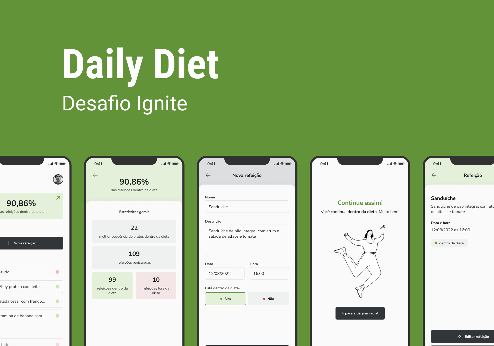

<h1 align="center">
    
</h1>

<h4 align="center"> 
     Aplicação Concluída!! 	
</h4>

 <a href="#-sobre-o-projeto">Sobre</a> •
 <a href="#-funcionalidades">Funcionalidades</a> •
 <a href="#-layout">Layout</a> • 
 <a href="#-como-executar-o-projeto">Como executar o site</a> • 
 <a href="#-tecnologias">Tecnologias</a> • 
 <a href="#-autor">Autor</a> • 
 <a href="#user-content--licença">Licença</a>

## 💻 Sobre o projeto

Este projeto consiste em app de dieta desenvolvido em forma de desafio durante a especialização
da Rocketseat o Daily Diet, nele foi usado a tecnoligia como ReactNative no front-end junto ao typescript e a estrategia Managed Workflow.
Usei styledComponents na estilização.
Usa hooks do tipo useState useEffect.
Criação de componentes que conversam
entre si, usando props e armazenamento na memoria cache do aparelho,[...]

---

- [x] cadastro de refeições
- [x] quadro de refeições 
- [x] mensagens se faz parte ou não da sua dieta 
- [x] validações
- [x] flatlist de refeições cadastradas com hora e data!

### App

  

  

  

---

---

## 🚀 Como ver o projeto/site

basta acessar o o link
[Daily-Diet](https://www.linkedin.com/in/deyvison-tavares/recent-activity/)

---

## 🛠 Tecnologias

As seguintes ferramentas foram usadas na construção do projeto:

#### **Website**/ ([Expo](https://docs.expo.dev/) + [bareWorkflow](https://docs.expo.dev/introduction/managed-vs-bare/) + [Ts](https://www.typescriptlang.org/docs/) + [ReactNative](https://reactnative.dev/docs/environment-setup))
---

## 🦸 Autor

 
<a href="https://github.com/DeyvisonTav">
 
  
  
 <b>Deyvison Tavares</b>🚀</a>
  
  

---

## 📝 Licença

Este projeto esta sobe a licença [MIT](./LICENSE).

Feito com ❤️ por Deyvison Tavares 👋🏽 [Entre em contato!](https://www.linkedin.com/in/deyvison-tavares/)